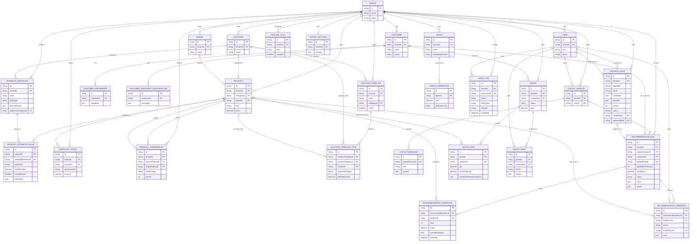

# ShopPilot ER Diagram

```mermaid
erDiagram
    TENANT {
      string id PK
      string name
      string status
    }

    USER {
      string id PK
      string tenantId FK
      string role
      string email
    }

    CATEGORY {
      string id PK
      string tenantId FK
      string name
    }

    BRAND {
      string id PK
      string tenantId FK
      string name
    }

    PRODUCT {
      string id PK
      string tenantId FK
      string categoryId FK
      string brandId FK
      string sku
      decimal price
    }

    ATTRIBUTE_DEFINITION {
      string id PK
      string tenantId FK
      string code
      string dataType
      json allowedValues
      string appliesToCategoryId FK
    }

    PRODUCT_ATTRIBUTE_VALUE {
      string id PK
      string productId FK
      string attributeDefinitionId FK
      string valueText
      decimal valueNumber
      boolean valueBoolean
      json valueJson
    }

    INVENTORY_STOCK {
      string id PK
      string tenantId FK
      string productId FK
      string warehouseId
      decimal quantity
    }

    CUSTOMER {
      string id PK
      string tenantId FK
      string name
      string phone
    }

    CUSTOMER_PREFERENCE {
      string id PK
      string customerId FK
      json metadata
    }

    CUSTOMER_WHATSAPP_CONVERSATION {
      string id PK
      string customerId FK
      json messages
    }

    PRODUCT_COMPATIBILITY {
      string id PK
      string tenantId FK
      string sourceProductId FK
      string targetProductId FK
      string relationType
      int priority
    }

    SOLUTION_TEMPLATE {
      string id PK
      string tenantId FK
      string code
      string categoryId FK
      boolean active
    }

    SOLUTION_TEMPLATE_ITEM {
      string id PK
      string solutionTemplateId FK
      string productCategoryId FK
      string productId FK
      string requirementType
      decimal defaultQuantity
    }

    DECISION_RULE {
      string id PK
      string tenantId FK
      string capability
      string name
      json conditions
      json outcome
      int version
      string status
      string createdById FK
      string approvedById FK
    }

    COPILOT_SESSION {
      string id PK
      string tenantId FK
      string userId FK
    }

    COPILOT_MESSAGE {
      string id PK
      string copilotSessionId FK
      string role
      text content
    }

    RECOMMENDATION_RUN {
      string id PK
      string tenantId FK
      string copilotSessionId FK
      string customerId FK
      string appliedRuleId FK
      int appliedRuleVersion
      decimal confidence
      string status
      json input
      json result
    }

    RECOMMENDATION_CANDIDATE {
      string id PK
      string recommendationRunId FK
      string productId FK
      int rank
      decimal score
      json scoreBreakdown
      boolean selected
    }

    RECOMMENDATION_FEEDBACK {
      string id PK
      string recommendationRunId FK
      string actorUserId FK
      string action
      string finalProductId FK
      text note
    }

    QUOTE {
      string id PK
      string tenantId FK
      string customerId FK
      string status
      decimal total
    }

    QUOTE_ITEM {
      string id PK
      string quoteId FK
      string productId FK
      decimal qty
      decimal priceSnapshot
      json productAttributesSnapshot
    }

    QUOTE_AUDIT {
      string id PK
      string quoteId FK
      string actorUserId FK
      string action
      text reason
    }

    AGENT {
      string id PK
      string tenantId FK
      string name
      string whatsappNumber
    }

    AGENT_COMMISSION {
      string id PK
      string agentId FK
      decimal rate
      date effectiveFrom
    }

    FEATURE_FLAG {
      string id PK
      string tenantId FK
      string key
      boolean enabled
    }

    TENANT_SETTINGS {
      string id PK
      string tenantId FK
      json settings
    }

    AUDIT_LOG {
      string id PK
      string tenantId FK
      string actorUserId FK
      string action
      string entityType
      string entityId
      datetime createdAt
    }

    TENANT ||--o{ USER : has
    TENANT ||--o{ CATEGORY : owns
    TENANT ||--o{ BRAND : owns
    TENANT ||--o{ PRODUCT : owns
    CATEGORY ||--o{ PRODUCT : categorizes
    BRAND ||--o{ PRODUCT : brands

    TENANT ||--o{ ATTRIBUTE_DEFINITION : defines
    CATEGORY o|--o{ ATTRIBUTE_DEFINITION : scoped_to
    PRODUCT ||--o{ PRODUCT_ATTRIBUTE_VALUE : has
    ATTRIBUTE_DEFINITION ||--o{ PRODUCT_ATTRIBUTE_VALUE : typed_by

    TENANT ||--o{ INVENTORY_STOCK : tracks
    PRODUCT ||--o{ INVENTORY_STOCK : stocked_as

    TENANT ||--o{ CUSTOMER : has
    CUSTOMER ||--o{ CUSTOMER_PREFERENCE : has
    CUSTOMER ||--o{ CUSTOMER_WHATSAPP_CONVERSATION : has

    TENANT ||--o{ PRODUCT_COMPATIBILITY : defines
    PRODUCT ||--o{ PRODUCT_COMPATIBILITY : source
    PRODUCT ||--o{ PRODUCT_COMPATIBILITY : target

    TENANT ||--o{ SOLUTION_TEMPLATE : owns
    CATEGORY o|--o{ SOLUTION_TEMPLATE : for_category
    SOLUTION_TEMPLATE ||--o{ SOLUTION_TEMPLATE_ITEM : includes
    CATEGORY o|--o{ SOLUTION_TEMPLATE_ITEM : category_item
    PRODUCT o|--o{ SOLUTION_TEMPLATE_ITEM : concrete_item

    TENANT ||--o{ DECISION_RULE : owns
    USER ||--o{ DECISION_RULE : created_by
    USER o|--o{ DECISION_RULE : approved_by

    TENANT ||--o{ COPILOT_SESSION : owns
    USER ||--o{ COPILOT_SESSION : starts
    COPILOT_SESSION ||--o{ COPILOT_MESSAGE : contains

    TENANT ||--o{ RECOMMENDATION_RUN : records
    COPILOT_SESSION o|--o{ RECOMMENDATION_RUN : context
    CUSTOMER o|--o{ RECOMMENDATION_RUN : for_customer
    DECISION_RULE o|--o{ RECOMMENDATION_RUN : applied_rule
    RECOMMENDATION_RUN ||--o{ RECOMMENDATION_CANDIDATE : ranks
    PRODUCT ||--o{ RECOMMENDATION_CANDIDATE : candidate
    RECOMMENDATION_RUN ||--o{ RECOMMENDATION_FEEDBACK : receives
    USER o|--o{ RECOMMENDATION_FEEDBACK : actor
    PRODUCT o|--o{ RECOMMENDATION_FEEDBACK : final_choice

    TENANT ||--o{ QUOTE : owns
    CUSTOMER ||--o{ QUOTE : receives
    QUOTE ||--o{ QUOTE_ITEM : contains
    PRODUCT o|--o{ QUOTE_ITEM : snapshotted_from
    QUOTE ||--o{ QUOTE_AUDIT : audited_by
    USER ||--o{ QUOTE_AUDIT : actor

    TENANT ||--o{ AGENT : has
    AGENT ||--o{ AGENT_COMMISSION : rate_history

    TENANT ||--o{ FEATURE_FLAG : configures
    TENANT ||--|| TENANT_SETTINGS : has
    TENANT ||--o{ AUDIT_LOG : records
    USER o|--o{ AUDIT_LOG : actor
```
