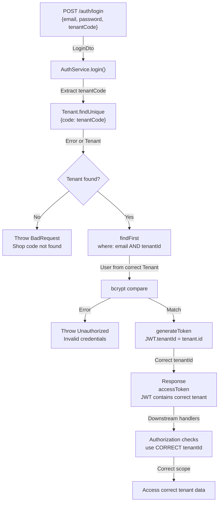

# Implementation Specification: DEF-001

## Cross-Tenant Login Vulnerability Fix

**Status:** Ready for Implementation  
**Severity:** Critical  
**Sprint:** 1 (Critical Platform Integrity)  
**Assigned:** Implementer  

---

## 1. PROBLEM STATEMENT

### Defect Description

The authentication system fails to enforce tenant isolation at the identity resolution layer. The login handler queries users by email only, without tenant context, enabling cross-tenant account compromise.

### Vulnerability Chain

```
Login Request: { email: "user@abc.com", password: "secret" }
  ↓
AuthService.login() calls:
  User.findFirst({ where: { email: "user@abc.com" } })
  ↓
Returns: User from Tenant A (or Tenant B, non-deterministic)
  ↓
Password matches → JWT generated with wrong tenantId
  ↓
Authenticated user can access all data from wrong tenant
```

### Impact

- **Cross-tenant data breach:** One tenant's user can authenticate as another tenant's user if they share email
- **JWT contains wrong tenantId:** All downstream authorization checks use wrong tenant context
- **Non-deterministic:** Database index determines which user record is returned
- **Silent failure:** No error or warning; appears to be successful authentication

### Current Code

**File:** [auth.service.ts#L78](file:///Users/sundara.v.rajendran/Documents/Projects/Learning/shoppilot/apps/api/src/modules/auth/auth.service.ts#L78)

```typescript
const user = await this.prisma.user.findFirst({
  where: { email: dto.email },  // ❌ Missing tenantId
  include: { tenant: true },
});
```

**Schema Constraint:** [schema.prisma#L269](file:///Users/sundara.v.rajendran/Documents/Projects/Learning/shoppilot/apps/api/prisma/schema.prisma#L269)

```prisma
@@unique([tenantId, email])  // Email unique per tenant, not globally
```

---

## 2. ARCHITECTURAL CONSTRAINTS

### Immutable Constraints

1. **Tenant Isolation Principle:** All user identity lookups MUST be scoped by tenant. No email-only queries allowed.
2. **Tenant Context Requirement:** Login request MUST include tenant identifier to disambiguate email within the multi-tenant boundary.
3. **JWT Correctness:** Generated JWT.tenantId MUST match the authenticated user's tenantId exactly.
4. **Schema Immutability:** Do NOT modify `@@unique([tenantId, email])` constraint.
5. **No Redesign:** Do NOT refactor AuthService, do NOT introduce new authentication paradigms, do NOT change public API contracts beyond adding tenantCode.

### Tenant Identifier Approaches

*Choose ONE:*

**Option A: tenantCode (String, User-Facing)**
- Client sends shop/business code: `{ email, password, tenantCode: "shop-abc" }`
- Implementer resolves Tenant via `findUnique({ code: tenantCode })`
- Familiar to users (shop code visible in domain, branding, etc.)
- Requires: Tenant.code unique constraint (already exists)
- UI: Shop code input field or derived from subdomain/context

**Option B: tenantId (UUID, System-Facing)**
- Client sends tenant UUID: `{ email, password, tenantId: "uuid-..." }`
- Direct lookup: `Tenant.findUnique({ id: tenantId })`
- Simpler code path, no string→UUID translation
- Risk: Exposes internal UUIDs to client; less user-friendly
- UI: Not suitable for user input; must be stored/managed by client

**Option C: Hybrid (Recommended)**
- Accept either tenantCode or tenantId in same request
- Implementer: `if (dto.tenantCode) { tenant = Tenant.findUnique({ code }) } else { tenant = Tenant.findUnique({ id }) }`
- Supports web (code) and mobile (id) use cases
- DTO: both fields optional, but at least one required

### No Breaking Changes (Unless Unavoidable)

- JWT structure unchanged
- User model unchanged
- Tenant model unchanged
- All downstream handlers expect same JWT format

---

## 3. AFFECTED MODULES

### Direct Changes Required

| Module | Component | Nature | Reason |
|---|---|---|---|
| **auth** | `AuthService.login()` | Modify | Add tenant-aware user resolution |
| **auth** | `LoginDto` | Extend | Add tenantCode/tenantId field |
| **auth** | Error handling | Verify | Ensure distinct error messages (400 vs 401) |

### Dependent Changes (Indirect)

| Module | Component | Nature | Reason |
|---|---|---|---|
| **web** | Login form/page | Modify | Capture and send tenant code |
| **web** | AuthService | Modify | Include tenant code in POST /auth/login |
| **api** | Integration tests | Add | Cross-tenant isolation tests |

### No Changes Required

- User model
- Tenant model
- JWT token structure
- AuthController endpoint contract (only DTO changes)
- All downstream authorization handlers
- Database schema (Tenant.code unique already exists)

---

## 4. DATA INVARIANTS (MUST BE PRESERVED)

1. **User-Tenant Association:** Each user.tenantId points to exactly one valid tenant. After fix: user resolution must verify tenant exists.
2. **Email Uniqueness:** Email is unique per tenant, not globally. After fix: enforced by composite query.
3. **JWT Tenant Binding:** JWT.tenantId matches authenticated user.tenantId. After fix: must be verified on generation.
4. **Active User Requirement:** Only active users (user.active === true) can authenticate. Existing logic, must preserve.
5. **Active Tenant Requirement:** Only active tenants (tenant.status !== SUSPENDED/CANCELLED) permit login. Existing logic, must preserve.
6. **No Shared Email Across Tenants During Login:** Two different users can have same email if in different tenants, but login must resolve to exactly one user (the one in the requested tenant).

---

## 5. ACCEPTANCE CRITERIA

All criteria are **testable** and **mandatory**. Criteria are **independent**—each can be verified in isolation.

### AC1: Tenant-Scoped User Resolution
- **When:** POST /auth/login with { email, password, tenantCode: TENANT_A }
- **Given:** User "alice@example.com" exists in Tenant A
- **Then:** System queries for user where email = "alice@example.com" AND tenantId = Tenant_A.id (or equivalent)
- **Evidence:** Code review of AuthService.login() or database query log shows composite filter

### AC2: Cross-Tenant Login Rejected
- **When:** POST /auth/login with { email, password, tenantCode: TENANT_B }
- **Given:** User "alice@example.com" exists in Tenant A (not Tenant B)
- **Then:** Return 401 Unauthorized; no JWT issued
- **Evidence:** Integration test LOGIN_CROSS_TENANT_REJECTED passes

### AC3: Correct Tenant Login Succeeds
- **When:** POST /auth/login with { email, password, tenantCode: TENANT_A }
- **Given:** User "alice@example.com" exists in Tenant A with correct password
- **Then:** Return 200 OK with accessToken; JWT.tenantId === Tenant_A.id
- **Evidence:** Integration test LOGIN_CORRECT_TENANT_SUCCESS passes

### AC4: JWT tenantId Matches Authenticated Tenant
- **When:** User authenticates via any valid login flow
- **Then:** Generated JWT.tenantId MUST equal user.tenantId
- **AND:** JWT.tenantId MUST equal the tenant specified in login request
- **Evidence:** Integration test LOGIN_JWT_TENANT_CONSISTENCY passes

### AC5: Invalid Tenant Code Rejected
- **When:** POST /auth/login with { email, password, tenantCode: "nonexistent" }
- **Then:** Return 400 Bad Request with clear error message (e.g., "Shop code not found")
- **Evidence:** Integration test LOGIN_INVALID_TENANT_CODE passes

### AC6: Missing Tenant Code Rejected
- **When:** POST /auth/login with { email, password } (no tenantCode/tenantId)
- **Then:** Return 400 Bad Request with message indicating tenant identifier is required
- **Evidence:** Determined by DTO validation (if DTO field is required) OR service-level check

### AC7: Concurrent Logins from Same Email (Different Tenants) Succeed Independently
- **When:** Two concurrent requests: POST /auth/login with same email but different tenantCodes
- **Then:** Both succeed; JWT1.tenantId ≠ JWT2.tenantId; each JWT contains correct tenant
- **Evidence:** Integration test LOGIN_CONCURRENT_TENANTS passes

### AC8: Existing Tenant Login Still Works (Regression)
- **When:** User follows existing login flow (pre-fix behavior, now with tenantCode added)
- **Then:** Valid credentials for valid tenant return 200 with correct JWT
- **Evidence:** Existing auth integration tests pass without modification

### AC9: Error Messages Distinguish Tenant vs Credential Errors
- **When:** Invalid credentials: 401 Unauthorized (confidential, no details)
- **And:** Invalid tenant: 400 Bad Request (tenant lookup failure, specific error message allowed)
- **Then:** Implementer must ensure error codes/messages are distinct
- **Evidence:** Code review or error handling test

### AC10: Tenant Active Status Enforced
- **When:** User tries to login to SUSPENDED/CANCELLED/PENDING tenant
- **Then:** Return 403 Forbidden (existing behavior must be preserved)
- **Evidence:** Existing test LOGIN_SUSPENDED_TENANT_REJECTED continues to pass

---

## 6. REGRESSION TEST MATRIX

### New Tests (Must Be Added)

| Test ID | Test Name | Setup | Action | Assertion | File |
|---|---|---|---|---|---|
| **RT-001** | LOGIN_CROSS_TENANT_BLOCKED | Tenant A: user@abc.com / pass123; Tenant B (empty) | POST /auth/login { email: "user@abc.com", password: "pass123", tenantCode: "tenant_b_code" } | 401 Unauthorized; no JWT | auth-tenant-isolation.e2e-spec.ts |
| **RT-002** | LOGIN_CONCURRENT_TENANTS | Tenant A: user@abc.com/pass123; Tenant B: user@abc.com/pass456 | Parallel: POST /auth/login with tenant_a_code + tenant_b_code | Both 200 OK; JWT1.tenantId="A"; JWT2.tenantId="B" | auth-tenant-isolation.e2e-spec.ts |
| **RT-003** | LOGIN_JWT_TENANT_CONSISTENCY | Tenant A: user@abc.com/pass123 | POST /auth/login { email, password, tenantCode: "a" } | JWT.tenantId === Tenant.id (decoded JWT payload verified) | auth-tenant-isolation.e2e-spec.ts |
| **RT-004** | LOGIN_MISSING_TENANT_CODE | Tenant A: user@abc.com | POST /auth/login { email, password } (no tenantCode) | 400 Bad Request; error message mentions tenant/shop code required | auth-tenant-isolation.e2e-spec.ts |
| **RT-005** | LOGIN_INVALID_TENANT_CODE | Tenant A: user@abc.com | POST /auth/login { email, password, tenantCode: "nonexistent" } | 400 Bad Request; error message = "Shop code not found" or similar | auth-tenant-isolation.e2e-spec.ts |
| **RT-006** | LOGIN_CORRECT_TENANT_SUCCESS | Tenant A: user@abc.com/pass123 | POST /auth/login { email: "user@abc.com", password: "pass123", tenantCode: "a" } | 200 OK; JWT returned and valid; JWT.tenantId correct | auth-tenant-isolation.e2e-spec.ts |
| **RT-007** | LOGIN_SAME_EMAIL_DIFFERENT_TENANT_PASSWORD | Tenant A: user@abc.com/passA; Tenant B: user@abc.com/passB | POST /auth/login { email, password: "passA", tenantCode: "b" } | 401 Unauthorized (password wrong for Tenant B) | auth-tenant-isolation.e2e-spec.ts |
| **RT-008** | LOGIN_INACTIVE_USER_REJECTED | Tenant A: user@abc.com (active=false) | POST /auth/login { email, password, tenantCode: "a" } | 401 Unauthorized (existing behavior preserved) | auth-tenant-isolation.e2e-spec.ts |

### Existing Tests (Must Still Pass Without Modification)

| Test Category | Tests Affected | Rationale |
|---|---|---|
| **auth.e2e-spec.ts** | All existing login tests | Must pass; these validate core auth flow with added tenantCode field |
| **auth.e2e-spec.ts** | register() tests | Unchanged; registration creates new tenant context |
| **auth.e2e-spec.ts** | validateToken() tests | Unchanged; JWT structure same |
| **auth.e2e-spec.ts** | refresh() tests | Unchanged; refresh flow same |
| **Integration tests** | All tests that login (copilot.e2e, quotes.e2e, etc.) | Must pass; login flow must support all downstream tests |

### Regression Test File Location

**New file:** `apps/api/test/auth-tenant-isolation.e2e-spec.ts`

Contains: All tests RT-001 through RT-008

---

## 7. NON-FUNCTIONAL REQUIREMENTS

### Performance

- **Tenant lookup latency:** Tenant.findUnique({ code }) ≤ 5ms (in-memory lookup, index-backed)
- **Login endpoint latency:** POST /auth/login ≤ 100ms p99 (inclusive of tenant lookup + user lookup + bcrypt)
- **No N+1 queries:** Implementer must use single composite query for tenant-aware user lookup; verify with query analysis

### Security

- **Error Message Confidentiality:** Do NOT reveal which tenant exists, which user exists, or why auth failed in 401 responses
- **Timing Attack Resistance:** bcrypt timing unchanged; no new timing-based leaks introduced
- **Brute Force Protection:** Existing rate limiting / lockout logic (if any) must remain in effect
- **Tenant Code Case Sensitivity:** TBD by implementer; if case-insensitive, document assumption

### Compatibility

- **Database:** Must work with PostgreSQL (existing)
- **ORM:** Prisma client, no raw SQL injected
- **Node.js:** Existing version (no upgrades)
- **Dependencies:** No new packages; use existing @nestjs, prisma, bcryptjs only

### Logging & Observability

- **Success logging:** Log successful login with user.id and tenant.id (no email)
- **Failure logging:** Log failed login attempts with tenant identifier and email (to detect brute force patterns)
- **No sensitive data:** Never log passwords, JWT tokens, or raw credentials
- **Structured logging:** Integrate with existing logger (NestJS injectable logger or equivalent)

---

## 8. OUT-OF-SCOPE ITEMS

**Explicitly NOT required by DEF-001:**

### Not Required

- [ ] Refactoring AuthService for testability
- [ ] Adding OAuth, MFA, or other auth methods
- [ ] Implementing rate limiting (if not already present)
- [ ] Changing password hashing algorithm
- [ ] Adding audit logging (beyond existing patterns)
- [ ] Implementing remember-me or persistent sessions
- [ ] Supporting passwordless authentication
- [ ] Adding SAML, LDAP, or identity federation
- [ ] Changing JWT structure or claims
- [ ] Introducing new tables or schema changes (beyond existing Tenant.code)

### May Be Required (Coordinate with Frontend Team)

- [ ] Updating web login form to capture tenant code
- [ ] Updating web AuthService to send tenant code
- [ ] Coordinating release timing between API and web

### These Are Handled Separately in Different Defects

- [ ] DEF-002: Mutations in read paths (GET /quotes endpoints)
- [ ] DEF-003: Quote state machine integrity
- [ ] DEF-004: Commission atomic operations
- [ ] DEF-005: Payment race conditions

---

## 9. DATA FLOW DEFINITIONS

### Before Fix (Current, Broken)

```mermaid
graph TD
    A["POST /auth/login<br/>{email, password}"] -->|LoginDto| B["AuthService.login()"]
    B -->|findFirst<br/>where: email only| C["Database<br/>(non-deterministic)"]
    C -->|User from A or B<br/>(indeterminate)| D["bcrypt compare"]
    D -->|Match| E["generateToken<br/>JWT.tenantId = ???"]
    E -->|Wrong tenantId| F["Response<br/>accessToken<br/>JWT contains wrong tenant"]
    F -->|Downstream handlers| G["Authorization checks<br/>use WRONG tenantId"]
    G -->|Breach| H["Access wrong tenant data"]
```

### After Fix (Required)



---

## 10. ROLLBACK STRATEGY

### Rollback Preconditions

Execute rollback if:
1. **Defect not resolved:** Cross-tenant login still possible after deployment
2. **Critical regression:** Valid user cannot login within 30 minutes of deploy
3. **Performance degradation:** Login latency exceeds 500ms p99
4. **API contract broken:** Web client cannot login due to new requirement

### Immediate Rollback (< 5 minutes)

1. **Revert commit** containing auth.service.ts and login.dto.ts changes
2. **Redeploy API** to previous known-good version
3. **Verify:** POST /auth/login { email, password } works without tenantCode
4. **Notify:** Frontend team that API rolled back; keep their changes staged but do not deploy

### Root Cause Analysis (Post-Rollback, 30 min)

- **If tenant lookup fails:** Tenant.code constraint missing? Schema mismatch?
- **If user lookup fails:** Where clause syntax error? Composite key not supported?
- **If bcrypt fails:** New password format issue? Upgrade incompatibility?
- **If JWT fails:** generateToken() broken? tenantId type mismatch?
- **If frontend blocked:** tenantCode not being sent? DTO validation too strict?

### Re-deploy After Fix

1. Fix identified issue
2. Run full regression test suite locally
3. Merge to main
4. Coordinate with frontend team
5. Deploy API + Web together (or sequence carefully)

### Fallback to Temporary Workaround (If Root Cause Unknown)

- Accept login without tenantCode for now (breaks security temporarily)
- Begin detailed investigation
- Create incident post-mortem
- **This is NOT a permanent solution; do not accept cross-tenant vulnerability**

---

## 11. IMPLEMENTATION FLEXIBILITY

The specification intentionally **allows multiple implementation approaches**. Implementer may choose:

### Tenant Identifier Strategy
- ✅ **Option A:** tenantCode only (string-based, user-friendly)
- ✅ **Option B:** tenantId only (UUID-based, system-friendly)
- ✅ **Option C:** Hybrid (both accepted, implementer chooses resolution order)
- ❌ Not allowed: email-only resolution (current broken approach)

### DTO Validation
- ✅ Use NestJS @IsNotEmpty() decorator on LoginDto
- ✅ Use service-level validation in AuthService.login()
- ✅ Use custom ValidationPipe
- ❌ Not allowed: no validation (accepting undefined tenantCode)

### Error Response Format
- ✅ 400 Bad Request for missing/invalid tenantCode
- ✅ 401 Unauthorized for incorrect password or nonexistent user at tenant
- ✅ 403 Forbidden for inactive tenant (existing behavior)
- ❌ Not allowed: same error code for different error types (must distinguish)

### Query Construction
- ✅ Prisma: `findFirst({ where: { email, tenantId } })`
- ✅ Prisma: `findUnique({ where: { tenantId_email: { email, tenantId } } })`
- ✅ Prisma: `findMany().then(filter in-memory)`
- ❌ Not allowed: raw SQL queries
- ❌ Not allowed: email-only queries

### Logging Approach
- ✅ Structured JSON logs with NestJS logger
- ✅ Minimal logging in AuthService (defer to middleware)
- ✅ Log failures for security monitoring
- ❌ Not allowed: logging plaintext passwords or tokens

---

## 12. RISK MITIGATION

| Risk | Likelihood | Impact | Mitigation |
|---|---|---|---|
| **Frontend not ready to send tenantCode** | Medium | High | **Mitigation:** Coordinate release; make both API + Web changes in parallel; stage changes, deploy together |
| **Tenant lookup fails silently** | Low | High | **Mitigation:** Add explicit error handling; test with nonexistent tenant code |
| **Performance regression (slow tenant lookup)** | Low | High | **Mitigation:** Verify Tenant.code has unique index; benchmark before/after |
| **Existing tests break** | Low | High | **Mitigation:** Run full test suite during implementation; update test fixtures to include tenantCode |
| **Case sensitivity of tenant code** | Medium | Low | **Mitigation:** Document assumption; test both lowercase and uppercase inputs |
| **JWT claims change unexpectedly** | Very Low | High | **Mitigation:** Code review JWT generation; verify payload structure in test |

---

## 13. VERIFICATION CHECKLIST (For Implementer)

**Before declaring DEF-001 complete, verify:**

- [ ] **Code Review:** auth.service.ts contains tenant-scoped user lookup (composite where clause)
- [ ] **Code Review:** LoginDto includes tenantCode or tenantId (or both)
- [ ] **Code Review:** Tenant lookup error handling distinguishes "not found" from other failures
- [ ] **Test Execution:** RT-001 through RT-008 all pass (new regression tests)
- [ ] **Test Execution:** Existing auth.e2e-spec.ts all pass (regression)
- [ ] **Test Execution:** Dependent tests (copilot.e2e, quotes.e2e, etc.) all pass
- [ ] **Manual Test:** Login with correct tenantCode → success, JWT correct
- [ ] **Manual Test:** Login with wrong tenantCode → 400 Bad Request
- [ ] **Manual Test:** Login with same email, different tenant → 401 Unauthorized
- [ ] **Manual Test:** No errors in application logs during tests
- [ ] **Query Analysis:** Verify composite query (no N+1)
- [ ] **Performance:** Login endpoint latency ≤ 100ms p99
- [ ] **Security Review:** No sensitive data in error messages or logs
- [ ] **Coordination:** Frontend changes staged and ready for parallel deployment

---

## 14. SIGN-OFF & APPROVAL

**Specification Status:** ✅ Ready for Implementation

**Approved By:** [Architect]  
**Reviewed By:** [Explorer - Codebase validation]  
**Implementation By:** [Implementer - To be assigned]  
**Verification By:** [Verifier - Post-implementation validation]  

---

## Appendix: Glossary

| Term | Definition |
|---|---|
| **tenantCode** | User-facing business/shop identifier (string, e.g., "shop-abc") |
| **tenantId** | System-internal tenant UUID |
| **Composite Query** | WHERE clause filtering by multiple fields (email AND tenantId) |
| **JWT tenantId** | tenantId claim in decoded JWT payload |
| **Cross-tenant Access** | User from Tenant A accessing Tenant B's data |
| **Active User** | User with active = true |
| **Active Tenant** | Tenant with status = ACTIVE (not SUSPENDED/CANCELLED/PENDING) |

